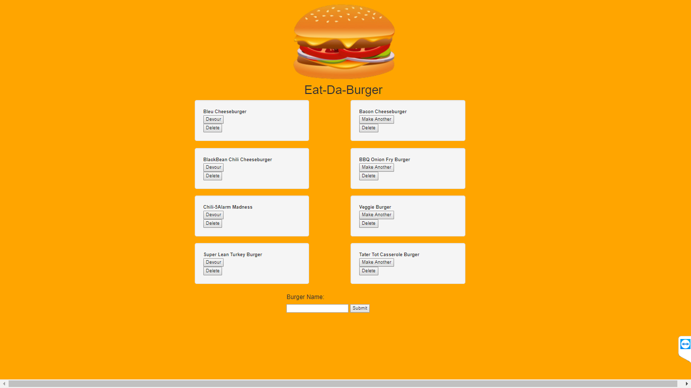

Visit Application: https://eat-da-burgers-.herokuapp.com/

# Eat-Da-Burger Web Application - Sequelized Version

Welcome to the Eat-Da-Burger app. This application allows users to create "burgers." When creating a burger the data is being pushed to a Sequelize database.  After the burger is created it appears on the screen using Handlebars.  At this point the user is able to click a "Devour" button.  This "eats" the burger, which is making a PUT request to the database and making a change to the Boolean of "devoured".  Once the Boolean has been changed the burger moves into other Devoured category.  The user is also able to click the "Make Another" button.  This also sends a PUT request changing the Boolean back on the database and thus moving to the Freshly Made category again using Handlebars.

## Technologies Used

* Node
* Express
* Handlebars
* Sequelize
* Heroku
* JawsDB
* Javascript
* Bootstrap
